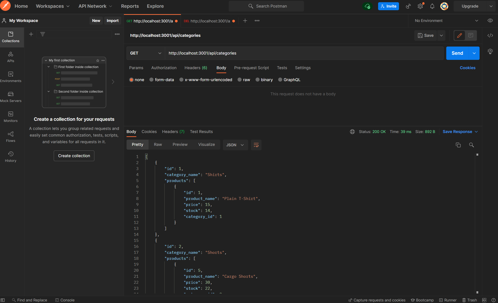

# ORM-E-Commerce
        
## Description
    
```md
AS A developer 
I WANT to create the back end for a manager's e-commerce website 
SO THAT the manager can utilize their latest technologies and compete with other e-commerce companies
```
    
## Table of Contents
    
- [Installation](#installation)
- [Usage](#usage)
- [License](#license)
- [Contribute](#contribute)
- [Questions](#questions)
    
## Installation
    
1) Go to my Github and clone the repo


<br>
2) Once downloaded, copy the code "npm install" and paste inside the terminal of your code editor


```bash
npm install
```
<br>
3) Once step 2 is completed, copy the code "node seeds/index.js" and paste inside the terminal to sync the seed data


```bash
node seeds/index.js
```
<br>
4) Once step 3 is completed, copy the code "node server.js" and paste inside the terminal to begin running the server


```bash
node server.js
```
<br>
    
 ## Usage
    
This app is designed to create a professional E-Commerce website using an Express.js API, Sequelize, and a MySQL database in order to successfully create, update, and delete data in the user's database 

[CLICK HERE](https://www.youtube.com/watch?v=jevL79M-LYg) if you would like to follow along with PART 1 of the demo on YouTube.
<br>

[CLICK HERE](https://www.youtube.com/watch?v=TArjyY7C8Z4) if you would like to follow along with PART 2 of the demo on YouTube.

<br>Here is an image of the application:



<br><br>
    
## License 
[](https://opensource.org/licenses/MIT)
    
    
The license included for this project is under MIT
    
    
## Contribute 
[](https://github.com/odingol/ORM-E-Commerce/issues)
    
Please click on the badge to report any issues if they exist
    

## Questions
    
Contact me: 

- [Github Profile](https://github.com/odingol) 
- [LinkedIn](https://www.linkedin.com/in/lamor-odingo/)

